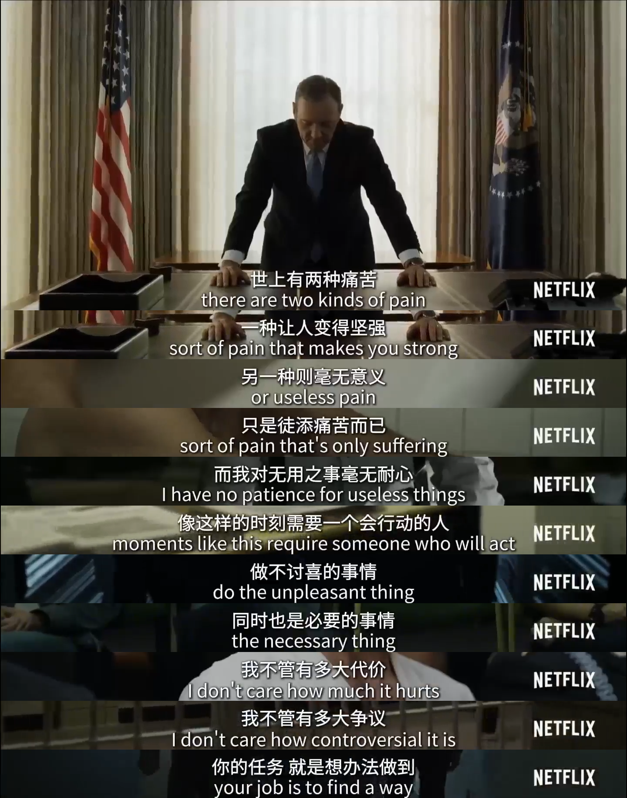

# 电影台词批量截图神器

> 🔗 **体验地址**: [stevenspage.github.io/video_screenshots](https://stevenspage.github.io/video_screenshots)

一个功能强大的视频截图工具，基于字幕批量生成视频截图并智能拼接。纯前端实现，数据完全本地处理。

## 📸 台词截图效果

## ✨ 核心功能

### 📸 智能截图系统（核心亮点）

- **批量截图**：选择多条字幕，一键批量截图
- **精准定位**：自动跳转到字幕对应的视频时间点截图
- **Shift连选**：支持Shift键快速选择连续多条字幕
- **智能搜索**：关键词搜索字幕，快速定位要截取的内容

### 🖼️ 手动精确截图(无字幕文件时)

- **手工截图**：播放暂停时，可对视频截图，多次截取一次拼图

### ▶️ 选定字幕重复播放

- **AB复读**：勾选多行台词，自动复读

### ✂️ 专业截图编辑器

- **可视化裁剪**：8个控制点精确调整裁剪区域
- **两种拼接模式**：
  - 🎬 **连续台词**：第一张完整画面，其余裁剪字幕区域（适合对话场景）
  - 🎞️ **连续画面**：所有截图使用统一裁剪（适合连续镜头）
- **自动裁剪应用**：调整第一张图片的裁剪，自动应用到后续截图
- **截图管理**：
  - 上移/下移调整顺序
  - 替换图片（支持导入外部图片）
  - 删除不需要的截图
  - 实时预览裁剪效果

### 🎨 灵活的拼接选项

- **自定义间距**：调整图片之间的间距（0-50px）
- **边距控制**：设置整体边距（0-50px）
- **背景颜色**：白色、黑色、灰色、紫色多种选择
- **原始尺寸输出**：保持视频原始分辨率，无损画质
- **实时预览**：拼接前预览最终效果
- **一键下载**：导出为PNG格式高清图片

### 适用场景

- 📚 **制作学习笔记**：截取教学视频的重点内容
- 🎬 **电影台词收集**：保存经典台词画面
- 📝 **视频总结**：快速生成视频内容概览
- 💬 **对话记录**：整理采访或对话内容
- 🎨 **素材收集**：为创作收集视频素材

## 📖 使用说明

### 快速开始截图

1. **加载视频和字幕**
   - 点击"选择视频"按钮选择视频文件
   - 点击"选择字幕"按钮选择 .srt 字幕文件
   - 或直接拖放视频和字幕文件到播放区域

2. **选择要截图的字幕**
   - 在右侧字幕列表中勾选需要截图的字幕
   - 💡 使用**Shift键**快速选择连续多条字幕
   - 💡 使用**搜索框**快速定位关键台词
   - 💡 点击**全选**勾选所有字幕（最多100条）

3. **生成截图**
   - 点击"生成截图"按钮
   - 系统会自动跳转到每条字幕的时间点进行截图
   - 等待截图完成（进度显示在按钮上）

4. **预览和下载**
   - 点击"预览拼接"查看最终效果
   - 满意后点击"下载拼接图"保存到本地

### 其他功能

- **字幕导航**：点击字幕跳转到对应视频时间点
- **字幕搜索**：输入关键词快速查找字幕
- **视频播放**：支持倍速播放和键盘快捷键控制

### 键盘快捷键

| 快捷键 | 功能 |
|--------|------|
| `空格` | 播放/暂停 |
| `←` | 后退 5 秒 |
| `→` | 前进 5 秒 |
| `↑` | 跳转到上一条字幕 |
| `↓` | 跳转到下一条字幕 |

### 支持的格式

- **视频格式**：MP4、WebM、Ogg、MKV 等
  - 注意：MKV 格式支持取决于浏览器和视频编码格式
  - 推荐使用 Chrome/Edge 浏览器以获得更好的 MKV 支持
- **字幕格式**：SRT（SubRip Text）

## 📋 字幕文件格式

项目支持标准的 SRT 字幕格式：

## 🎬 视频格式兼容性

### 推荐格式（完美兼容）

| 容器 | 视频编码 | 音频编码 | 兼容性 |
|------|---------|---------|--------|
| MP4 | H.264 | AAC/MP3 | ✅✅✅ 最佳 |
| WebM | VP8/VP9 | Opus/Vorbis | ✅✅ 很好 |

### 需要转换的格式

| 容器 | 音频编码 | 问题 | 解决方案 |
|------|---------|------|---------|
| MKV | AC3/DTS | ❌ 浏览器不支持 | 转换为 MP4|
| MOV | ALAC | ⚠️ 部分不支持 | 转换音频为 AAC |

## 🤝 贡献

欢迎提交 Issue 和 Pull Request！

## 📄 许可证

MIT License

---

如有任何问题或建议，请提交 Issue。祝使用愉快！ 🎉

